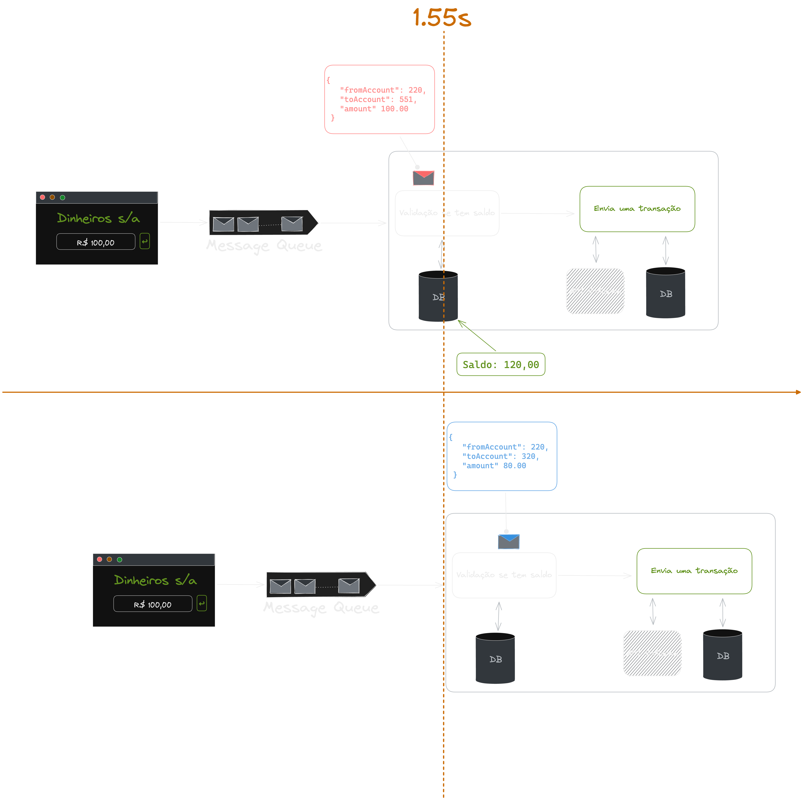
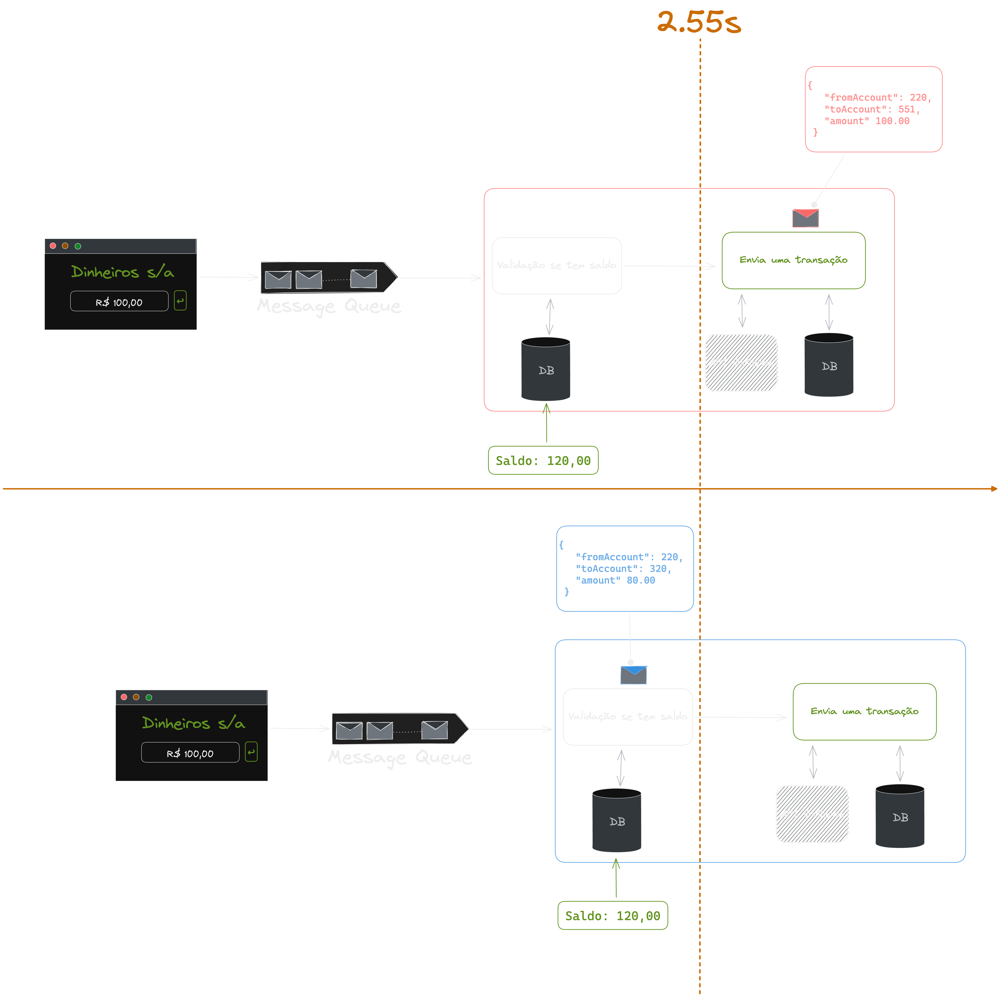
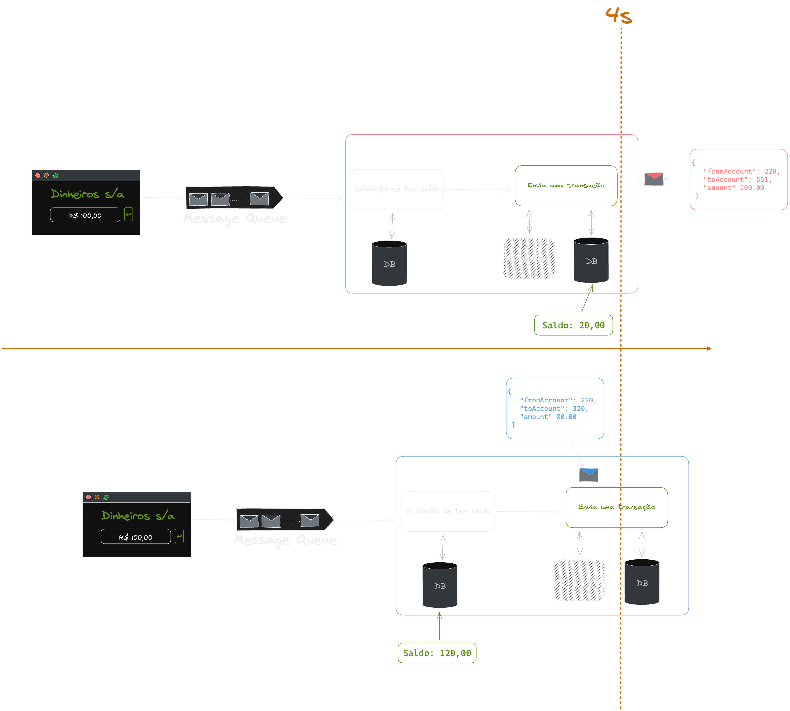
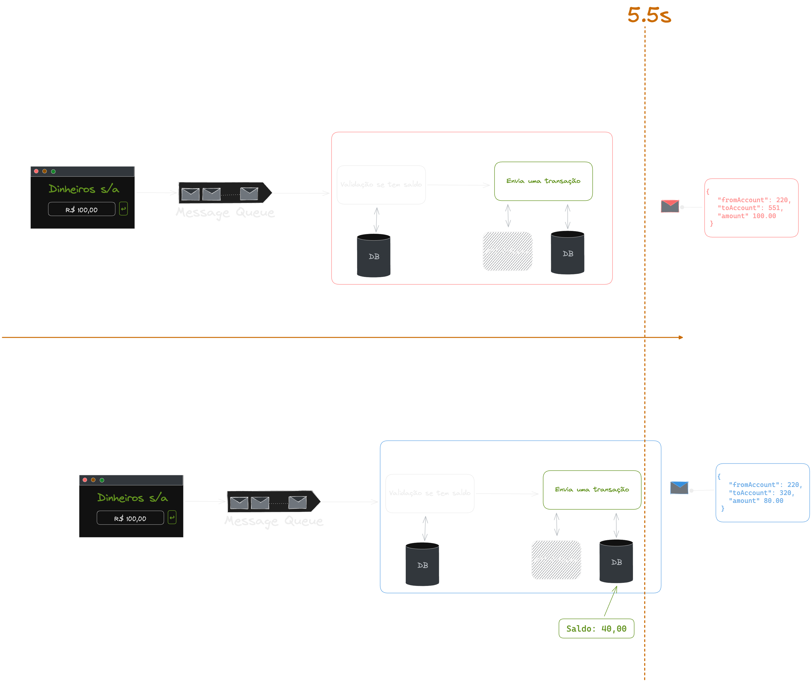
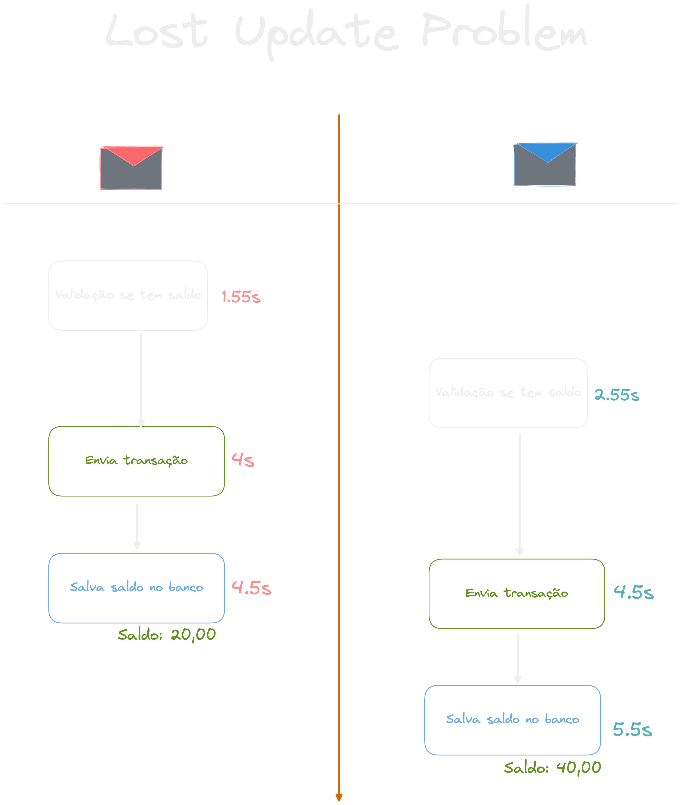
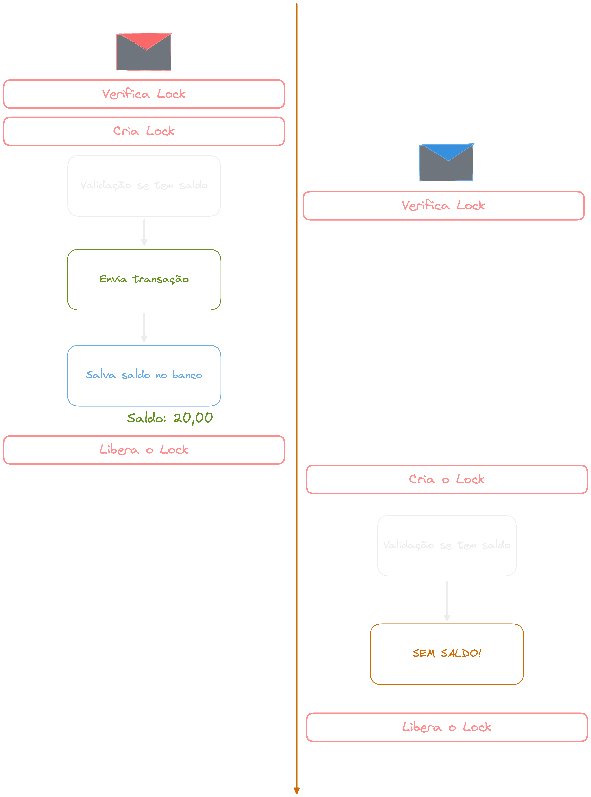
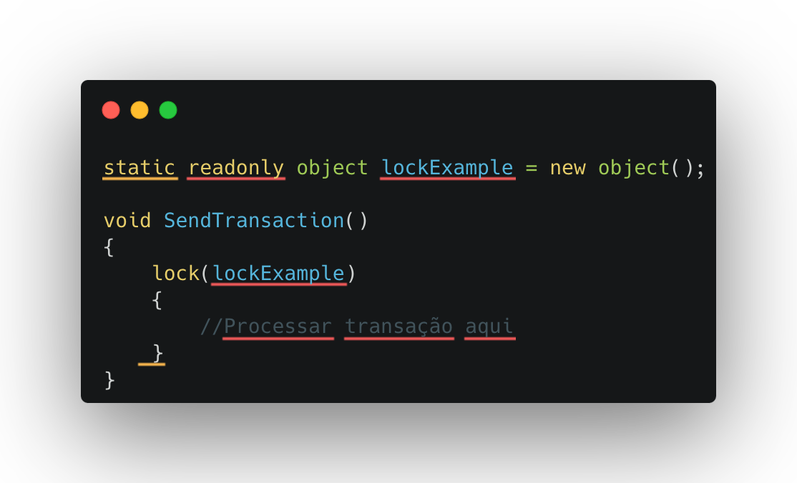
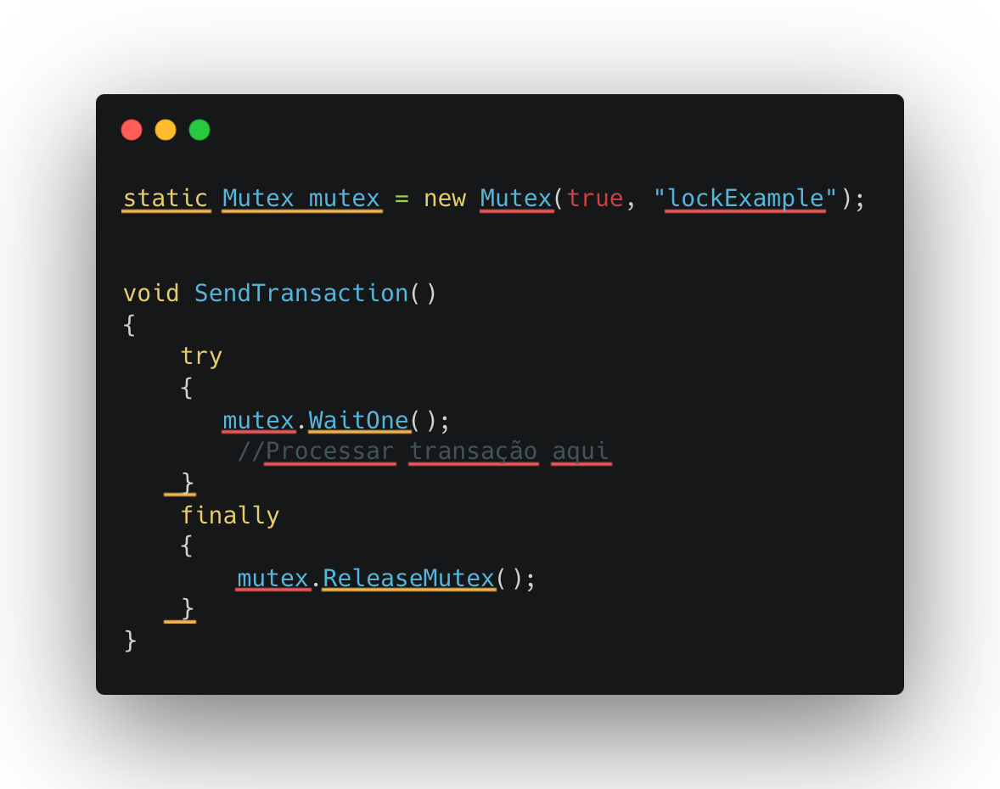
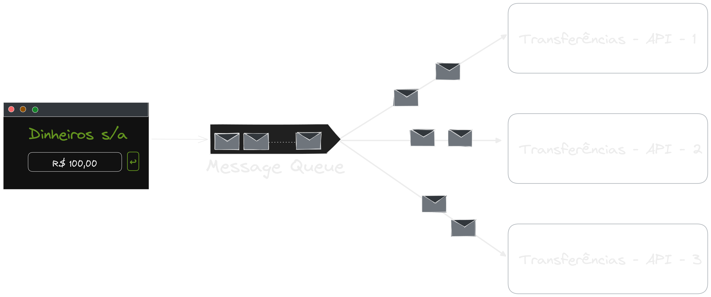
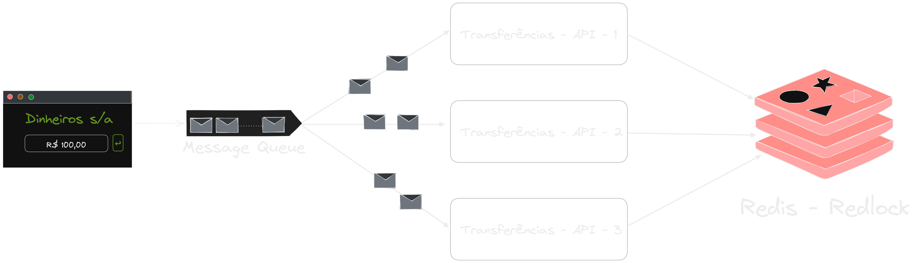

## Distributed Lock

{width=40%}

---

#### Exemplo

{width=100%}

---

{width=100%}

---

{width=100%}

---

{width=100%}

---

{width=100%}

---

{width=100%}

---

### Race Condition

{width=70%}

---

{width=75%}

---

{width=70%}

---

{width=80%}

---

{width=80%}

---

{width=58%}

---

### Como Resolver❓

---

### Lock

# 🔒

---

{width=50%}

---

{width=50%}

---

### Onde é feito Lock?

---

### Memória RAM

{width=100%}

---

### Mutex

{width=80%}

---

### Escala horizontal

---

### Distributed Lock

##### DLM - Distributed Lock Manager

---

---

### Optimistic Locking

## vs

### Pessimistic Locking
